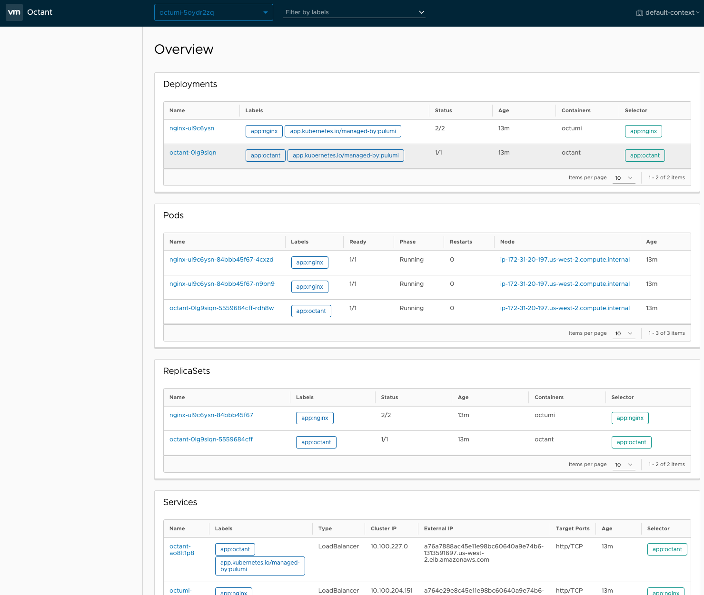

# octumi

Deploy [VMware Octant](https://github.com/vmware/octant) on an Amazon EKS cluster using [Pulumi](https://pulumi.com).

## Pre-Requisites

1. [Install Pulumi](https://www.pulumi.com/docs/reference/install).
1. Install [Node.js](https://nodejs.org/en/download).
1. Install a package manager for Node.js, such as [NPM](https://www.npmjs.com/get-npm) or [Yarn](https://yarnpkg.com/lang/en/docs/install).
1. [Configure AWS Credentials](https://www.pulumi.com/docs/reference/clouds/aws/setup/).
1. [Install AWS IAM Authenticator for Kubernetes](https://docs.aws.amazon.com/eks/latest/userguide/install-aws-iam-authenticator.html).
1. [Install `kubectl`](https://kubernetes.io/docs/tasks/tools/install-kubectl/#install-kubectl).

## Initialize the Pulumi Project

1.  Clone the repo:

    ```bash
    git clone https://github.com/metral/octumi
	cd octumi
    ```

1.  Install the dependencies.

    ```bash
    npm install
    ```

1.  Create a new Pulumi [stack][stack] named `dev`.

    ```bash
    pulumi stack init dev
    ```

1. Set the Pulumi [configuration][pulumi-config] variables for the project.

    > **Note:** Select any valid EKS region.

    ```bash
    pulumi config set aws:region us-west-2
    ```

## Create an EKS cluster and Deploy the Workload and Octant

Create the cluster and deploy the workload by running an update:

```bash
pulumi up
```

The update takes ~15 minutes.

Once the update is complete, verify the cluster, node groups, and Pods are up
and running:

```bash
pulumi stack output kubeconfig > kubeconfig.json && export KUBECONFIG=$PWD/kubeconfig.json
kubectl get nodes -o wide --show-labels
kubectl get pods --all-namespaces -o wide --show-labels
```

## Access the Workload and Octant

Visit the URL's stored in the output for NGINX and Octant:

```bash
pulumi stack output nginxUrl
pulumi stack output octantUrl
```



## Clean Up

Run the following command to tear down the resources that are part of our
stack.

1. Run `pulumi destroy` to tear down all resources.  You'll be prompted to make
   sure you really want to delete these resources.

   ```bash
   pulumi destroy
   ```

1. To delete the stack, run the following command.

   ```bash
   pulumi stack rm
   ```
   > **Note:** This command deletes all deployment history from the Pulumi
   > Console and cannot be undone.

[stack]: https://www.pulumi.com/docs/reference/stack.md"
[pulumi-config]: https://www.pulumi.com/docs/reference/config"
